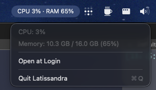

<div align="center">


# Latissandra

A tiny macOS menu bar monitor that shows live **CPU** and **RAM** usage.
Named after Kassandra, my dog who barks at the slightest disturbance.

[](https://github.com/SolenesInc/latissandra/actions/workflows/ci.yml)




</div>

## No network. At all.

The reason I decided to build this, when so many others are out there: internet.
Latissandra is local only. It reads CPU and memory straight from the
kernel via Mach APIs (`host_statistics` / `host_statistics64`). There is no
networking code, no telemetry, no update check, no privileged helper, and no
special entitlements.

You can confirm it yourself, this prints nothing:

```sh
grep -rinE 'URLSession|URLRequest|NWConnection|http|socket' Sources/
```

The only frameworks it links are AppKit, Foundation, CoreFoundation, and
ServiceManagement (for the optional "Open at Login" toggle).

## Requirements

- macOS 13 (Ventura) or later
- The Swift toolchain — Xcode Command Line Tools are enough (`xcode-select --install`).
  Full Xcode is **not** required.

## Build

```sh
./build.sh
```

This produces `build/Latissandra.app`, ad-hoc code signed so macOS launches it
without complaint. 

Ad-hoc signing is fine for personal use, a paid Apple Developer
ID is only needed to distribute the app to other people, which is exactly what this avoids.

## Run

```sh
open build/Latissandra.app
```

It appears in the menu bar only (no dock icon). Quit it from its own dropdown
("Quit Latissandra").

### Verify the numbers without the GUI

```sh
./build/Latissandra.app/Contents/MacOS/Latissandra --probe
```

Prints a single CPU/RAM reading and exits.

## Start automatically at login

Open the dropdown and toggle **Open at Login**. This uses `SMAppService`
(macOS 13+) to register the app as a login item, the same list you'd see under
System Settings → General → Login Items, just toggled from the app.

The registration points at the app's current location, so move `Latissandra.app`
somewhere stable before enabling it:

```sh
cp -R build/Latissandra.app /Applications/
open /Applications/Latissandra.app
```

If you move the app later, toggle Open at Login off and on again to re-point it.

## How it works

| File | Responsibility |
|------|----------------|
| `Sources/CPUSampler.swift`    | CPU % from cumulative kernel "ticks" (delta between samples). |
| `Sources/MemorySampler.swift` | Memory used ≈ App + Wired + Compressed (matches Activity Monitor). |
| `Sources/LoginItem.swift`     | "Open at Login" toggle via `SMAppService` (macOS 13+). |
| `Sources/AppDelegate.swift`   | The menu bar item; refreshes every 2 s. |
| `Sources/main.swift`          | Entry point; runs as a menu-bar-only app. |

Memory "used" deliberately approximates Activity Monitor's *Memory Used* (App
Memory + Wired + Compressed) instead of the naive `total − free`, which counts the
evictable file cache as used and looks alarmingly high.

### Regenerating the icon

The icon is rendered from code (a white pawprint on a blue→indigo squircle):

```sh
./tools/make_icons.sh
```

This rewrites `docs/images/icon_1024.png` and `Resources/AppIcon.icns`.

## Development

The project uses Apple's `swift-format` (bundled with the Swift toolchain) 
for both formatting and linting, and a small dependency-free test
runner. Every push and pull request runs lint → build → test via GitHub Actions
([`.github/workflows/ci.yml`](.github/workflows/ci.yml)).

```sh
./tools/format.sh   # auto-format Sources and Tests in place
./tools/lint.sh     # check formatting/style (fails on violations)
./tools/test.sh     # compile and run the test suite
```

## License

[MIT](LICENSE) © 2026 [SolenesInc](https://github.com/SolenesInc)
